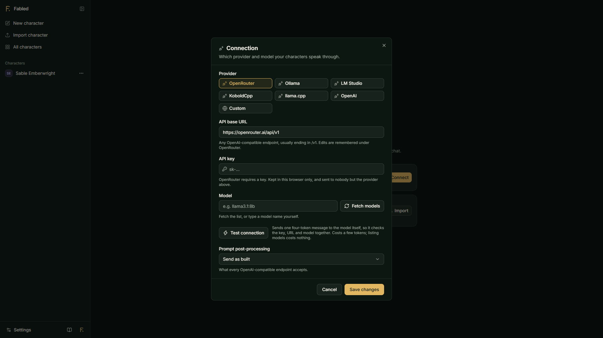
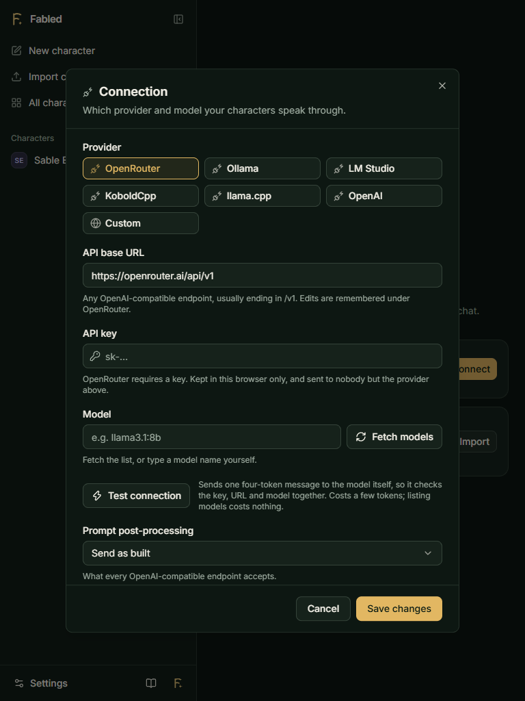

# Fabled

A minimal roleplay chat frontend in the spirit of SillyTavern: streaming chat with any OpenAI-compatible API, Tavern character cards (PNG/JSON, import from Chub), lorebooks, swipes, branching, chat memory, and more. It's local-first and runs entirely in the browser as static files - no server, no accounts. Everything (characters, chats, settings, your API key) is stored in IndexedDB in your own browser, and your messages go straight from the page to whichever provider you connect. Back up and restore your data from **Settings -> Data**.

## Screenshots

 

## Run it

Requires **Node 22.18+**.

```bash
npm install
npm run dev          # http://localhost:5173
```

## Build / deploy

```bash
npm run build        # static files in dist/
npm run preview      # try the build at http://localhost:4173
```

`dist/` can go on any static host (GitHub Pages, Cloudflare Pages, Netlify, Vercel, a plain web server). This repo also has a GitHub Actions workflow (`.github/workflows/deploy.yml`) that builds and deploys to GitHub Pages on push to `main`.

## Tests

```bash
npm test          # node --test
npm run typecheck
npm run check     # both
```
